# Foody App — System Documentation

> **Audience:** Anyone joining the project — developers, testers, product managers, or non-technical stakeholders.  
> **Goal:** Understand how the whole system works without reading every line of code.

---

## Table of Contents

1. [Big Picture — How Everything Connects](#1-big-picture)
2. [Authentication — Keycloak & JWT](#2-authentication)
3. [Registration & Login Flow](#3-registration--login-flow)
4. [Database Structure](#4-database-structure)
5. [API Structure — Symfony / API Platform](#5-api-structure)
6. [Food Offer Lifecycle](#6-food-offer-lifecycle)
7. [Order Lifecycle](#7-order-lifecycle)
8. [Customer Dashboard](#8-customer-dashboard)
9. [Business Partner Dashboard](#9-business-partner-dashboard)
10. [Admin Dashboard](#10-admin-dashboard)
11. [Caching Architecture](#11-caching-architecture)
12. [Tech Stack Reference](#12-tech-stack-reference)

---

## 1. Big Picture

### Architecture Diagram

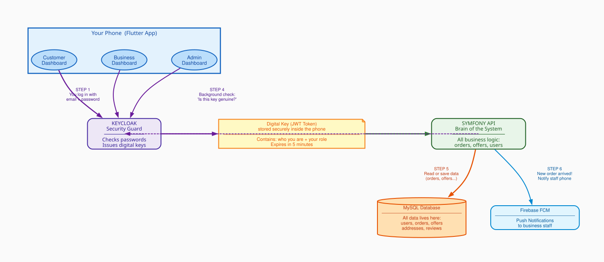

### Arrow color meaning

| Color | Meaning | Which steps |
|-------|---------|-------------|
| Purple | Security / Login flow — proving who you are | Steps 1, 2, and the background check in Step 4 |
| Green | Data request — asking for or sending data | Step 3 (app → Symfony) |
| Orange | Database access — reading or writing to MySQL | Step 5 (Symfony → MySQL) |
| Blue | Push notification — alerting business staff | Step 6 (Symfony → Firebase) |

### Step-by-Step: What Happens When You Use the App

**Step 1 — You log in (phone → Keycloak)**  
When you tap "Log In", the app sends your email and password to **Keycloak** — a dedicated security service running on the server. Its only job is to check passwords and decide who gets in. Your password never goes anywhere else.

**Step 2 — You receive a digital key (Keycloak → phone)**  
If your password is correct, Keycloak creates a small digital key called a **JWT token** and sends it back. Think of it like a wristband at a venue — you show your passport once at the door, receive the wristband, then show the wristband at every door inside. The token contains who you are, your role, and an expiry time (5 minutes). The app stores it in the phone's encrypted keychain.

**Step 3 — Every request carries the digital key (phone → Symfony)**  
From this point, every time the app needs data — loading offers, placing an order, viewing history — it sends the JWT token automatically. The user never sees this. It is the equivalent of showing your wristband at every door.

**Step 4 — Background security check (Symfony → Keycloak, dashed)**  
When Symfony receives a request, it verifies the digital signature of the token in milliseconds. If the token is invalid, expired, or tampered with, the request is rejected immediately. The user never notices — it is completely silent.

**Step 5 — Read or write data (Symfony → MySQL)**  
Once the token is verified, Symfony talks to the MySQL database to get or save data. Every user, order, food offer, address, and review lives in MySQL.

**Step 6 — Push notification (Symfony → Firebase)**  
When a customer places a new order, Symfony sends a push notification to the business partner's staff phones via Firebase FCM. This is what makes the "New order!" alert appear instantly on the business partner's screen.

### Real example

> Maria opens the app and taps "Browse Food". Steps 1+2 already happened at login. Now: the app asks Symfony "give me all active food offers" with the JWT token attached. Symfony verifies the token (Step 4, invisible). Symfony asks MySQL for active offers (Step 5). MySQL returns the list. Maria sees it on screen — in under a second.

### What each layer does

| Layer | Technology | Simple explanation |
|-------|------------|-------------------|
| Mobile App | Flutter | The app users see. Three separate dashboards (Customer, Business, Admin) in one codebase. |
| Security Guard | Keycloak (Docker) | Checks passwords at login. Issues digital key (JWT). Never involved again until the key expires. |
| API / Brain | Symfony + API Platform | Does all the real work: manages orders, offers, prices, stock, addresses. Trusts the digital key. |
| Storage | MySQL (Docker) | Stores everything permanently: every user, order, offer, address, review. |
| Push Alerts | Firebase FCM | Delivers instant push notifications to business staff phones when a new order arrives. |
| Infrastructure | Docker | Keycloak and MySQL each run in isolated containers. Easy to deploy and maintain. |

---

## 2. Authentication

### Auth Flow Diagram

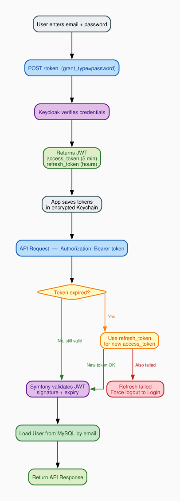

### JWT Token Structure

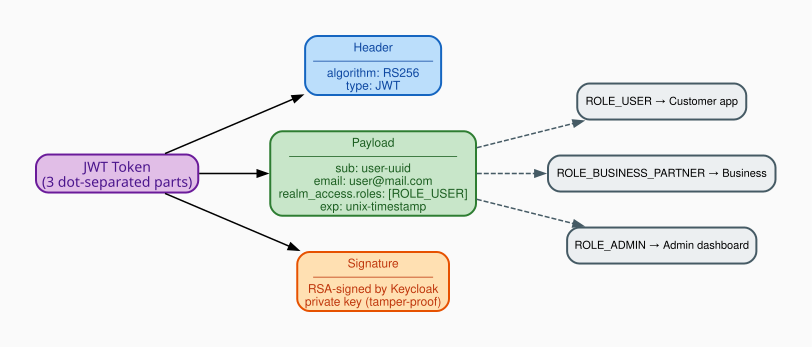

### What is Keycloak?

Keycloak is a dedicated login service — its only job is managing passwords and issuing tokens. The app never stores or verifies passwords directly. It runs on our own Docker infrastructure (no third-party).

### What is a JWT Token?

A JWT (JSON Web Token) is a small encoded text string passed with every API request. It has three dot-separated sections:

- **Header** — which algorithm signed it (RS256)
- **Payload** — your identity: UUID, email, roles, expiry time
- **Signature** — Keycloak's cryptographic seal; any tampering breaks this

### Token storage

| Key | Content | Lifetime | Storage |
|-----|---------|----------|---------|
| `kc_access_token` | JWT sent with every request | ~5 minutes | iOS Keychain / Android Keystore (encrypted) |
| `kc_refresh_token` | Used to silently get a new token | Hours | Same encrypted storage |
| `kc_id_token` | User profile info | ~5 minutes | Same encrypted storage |

> **Token Expiry:** Access tokens expire after 5 minutes. The app automatically uses the refresh token to get a new one silently — the user never sees a re-login prompt unless the refresh token also expires.

### Auth Interceptor — Automatic Token Management

A Dio HTTP interceptor runs before every API call. It:
1. Reads the stored access token
2. Checks if it will expire in the next 30 seconds
3. If yes, silently calls Keycloak with the refresh token to get a new one
4. Attaches the valid token to the request header
5. If refresh also fails — clears tokens and redirects to Login screen

### Physical Device — Dev Host Detection

On development builds the app must reach the backend running on a laptop. The IP changes per network. `ApiConstants.resolveDevHost()` probes each known IP in a priority list by opening a TCP socket and uses the first one that responds.

**Where it runs:** `resolveDevHost()` is called from `AuthGate._bootstrap()` — the real splash/entry screen. It runs **in parallel** with the auth check and the minimum 1.6 s animation delay, so host resolution never adds extra wait time for the user.

```
AuthGate opens
  ├─ resolveDevHost()         ← probes all hosts simultaneously
  ├─ isLoggedIn() check       ← reads stored tokens
  └─ 1600 ms animation delay
All three finish → navigate to correct screen
```

**Probe strategy:** Both ports (8082 Keycloak, 8081 API) are probed **in parallel per host**, with a 1 000 ms timeout each. All hosts are also probed in parallel. Worst case (all hosts unreachable): 1 000 ms total — comfortably within the animation window.

```
10.0.2.2      → Android emulator (fixed alias to host machine)
localhost     → iOS simulator (shares Mac's network stack)
192.168.x.x   → local home/office router (physical device)
10.202.x.x    → hotspot
```

Falls back to the first entry if none respond.

**Dio base URL — dynamic resolution:** The `ApiService` Dio instance is created at app startup before `resolveDevHost()` has run. To avoid freezing the base URL at the wrong host, an interceptor rewrites `baseUrl` on every request:

```dart
// In ApiService constructor — runs before every HTTP call:
dio.interceptors.add(InterceptorsWrapper(
  onRequest: (options, handler) {
    options.baseUrl = ApiConstants.baseUrl; // reads the resolved host each time
    handler.next(options);
  },
));
```

This means even if the Dio instance was created before the host was known, every request uses the correct resolved host.

Auth Dio also has explicit `connectTimeout` (8 s) and `receiveTimeout` (10 s) so connection errors on physical devices surface a meaningful message instead of hanging indefinitely.

---

## 3. Registration & Login Flow

### Registration Flow

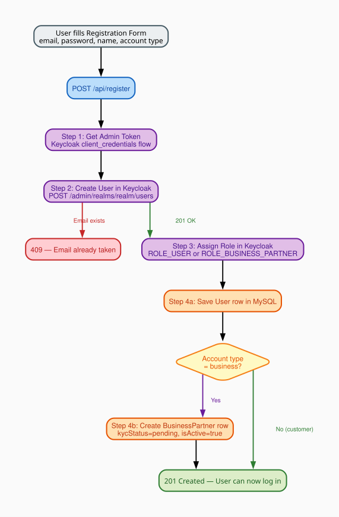

> **Why two systems?** Keycloak owns authentication (passwords, sessions). MySQL owns business data (orders, offers, addresses). When registering, both must be updated in one request — the Symfony backend coordinates this automatically.

> **KYC Gate:** A business with `kycStatus = 'pending'` cannot publish food offers. An Admin must approve the account first.

### Role-Based Routing After Login

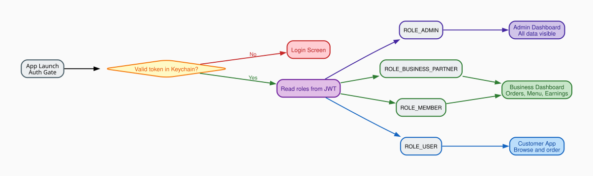

After login the app reads the roles from the JWT and navigates to the correct dashboard:

| Role | Destination | What they see |
|------|------------|---------------|
| `ROLE_ADMIN` | Admin Dashboard | Platform-wide stats, all users, all orders, KYC approval |
| `ROLE_BUSINESS_PARTNER` | Business Dashboard | Their orders, menu management, earnings |
| `ROLE_MEMBER` | Business Dashboard | Same as business partner (staff account) |
| `ROLE_USER` | Customer App | Browse offers, place orders, favorites |

---

## 4. Database Structure

### Entity Relationship Diagram

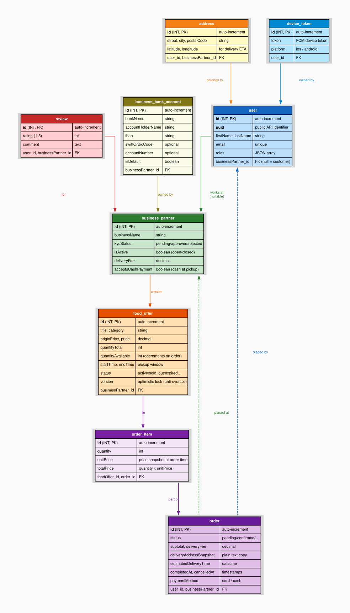

### How to Read the Diagram

Each **table** is a box with its columns listed inside. **Arrows between boxes** show a relationship — for example "order belongs to user". An arrow with a dashed line means the relationship is optional.

### Real Example — Maria Orders a Sushi Bag from Mario's Bistro

Let's trace exactly which database records are created or updated:

1. **user table** — Maria's row already exists. `email=maria@mail.com`, `roles=["ROLE_USER"]`, `businessPartner_id=NULL` (she is a customer).
2. **business_partner table** — Mario's Bistro row: `businessName="Mario's Bistro"`, `isActive=true`, `kycStatus="approved"`, `deliveryFee=2.50`.
3. **food_offer table** — The "Sushi Bag" row: `salePrice=5.99`, `quantityAvailable=3`. When Maria orders 1 bag, `quantityAvailable` drops to **2**.
4. **order table** — New row created: `status=pending`, `paymentStatus=pending`, `subtotal=5.99`, `deliveryFee=2.50`, `deliveryAddressSnapshot="Karl-Marx-Str. 12, 12043 Berlin"` (plain text copy — never changes), `user_id=Maria's id`, `businessPartner_id=Mario's id`.
5. **order_item table** — New row: `quantity=1`, `unitPrice=5.99` (copied from food_offer at this moment), `totalPrice=5.99`, `titleSnapshot="Sushi Bag"` (copied from food_offer title at this moment), `categorySnapshot="restaurant"` (copied from food_offer category at this moment).

> **Why is the price copied?** If Mario later changes the Sushi Bag to €7.99, Maria's old order still correctly shows €5.99 — because we saved the price at the time she ordered. Just like a paper receipt.

> **Why are title and category copied?** If Mario deletes the "Sushi Bag" offer later, Maria's order history still shows the correct item name and category — because `titleSnapshot` and `categorySnapshot` were saved at order time on `order_item`. The app uses these snapshots as the primary display value and only falls back to the live offer data for orders placed before the snapshot fields were introduced.

### Table-by-Table Explanation

#### user — every person who uses the app

| Column | Example | What it means |
|--------|---------|---------------|
| uuid | `550e8400-e29b-…` | Public unique ID used in all API responses |
| email | `maria@mail.com` | Unique — also matches the Keycloak login |
| roles | `["ROLE_USER"]` | Controls which dashboard appears after login |
| businessPartner_id | `NULL` / `7` | NULL = customer. A number = this person works at that restaurant |

#### business_partner — each restaurant or shop

| Column | Example | What it means |
|--------|---------|---------------|
| kycStatus | `pending` / `approved` | Only approved businesses can publish food offers |
| isActive | `true` / `false` | false = restaurant closed; offers disappear from customer Home |
| deliveryFee | `2.50` | Added to every order total for this business |
| acceptsCashPayment | `true` / `false` | When true, customers see a "Pay at Pickup (Cash)" option on checkout |
| contactPhone | `+49 30 123456` | Optional public contact phone number for the business |
| contactEmail | `info@mario.de` | Optional public contact email address for the business |

#### food_offer — a surplus food bag listing

| Column | Example | What it means |
|--------|---------|---------------|
| originalPrice | `12.00` | Full retail price shown struck-through (was `originPrice` before migration) |
| salePrice | `5.99` | Discounted price the customer pays (was `price` before migration) |
| quantityAvailable | `3 → 2 → 0` | Decrements with each order; 0 = shown as "sold out". NULL for weight-based offers. |
| startTime / endTime | `18:00 – 20:00` | Pickup window; after endTime the offer is "expired" |
| status | `active` | Raw stored value — the API computes the real status at runtime |
| version | `1, 2, 3…` | Optimistic lock — prevents two customers buying the last bag simultaneously |
| isWeightBased | `false` / `true` | When true, quantity fields are NULL and weight fields are used instead |
| pricePerKg | `3.50` | Price per kilogram — only used when `isWeightBased = true` |
| weightTotalKg | `5.0` | Total weight in kg available — only for weight-based offers |
| weightAvailableKg | `4.5` | Remaining kg available — decrements per order |
| minOrderKg | `0.5` | Minimum order in kg — optional, only for weight-based offers |

> **Piece-based vs weight-based:** Most offers (bread bags, meal boxes) are piece-based — the customer buys N bags. Butchers, delis, or fishmongers may sell by weight — the customer specifies how many kg they want. The `isWeightBased` flag selects the right model for each offer.

#### order + order_item — the customer's purchase

| Column | Example | What it means |
|--------|---------|---------------|
| status | `pending → confirmed → completed` | Tracks where the order is in the lifecycle |
| paymentStatus | `pending` / `paid` / `refunded` | Tracks payment state separately from delivery status |
| cancellationReason | `"Changed my mind"` | Optional free-text reason stored when an order is cancelled |
| deliveryAddressSnapshot | `"Karl-Marx-Str. 12, Berlin"` | Plain text copy saved at order time — immune to future address changes |
| paymentMethod | `card` / `cash` | Records how the customer chose to pay at checkout. Only `card` or `cash` are valid values. |
| order_item.unitPrice | `5.99` | Price copied from food_offer at order time — immune to future price changes |
| order_item.titleSnapshot | `"Sushi Bag"` | Title copied from food_offer at order time — survives offer deletion |
| order_item.categorySnapshot | `"restaurant"` | Category copied from food_offer at order time — survives offer deletion |

#### business_bank_account — bank accounts per business

| Column | Example | What it means |
|--------|---------|---------------|
| bankName | `ING` | Display name of the bank |
| accountHolderName | `Mario Rossi` | Name on the account |
| iban | `NL91 ABNA 0417 …` | International bank account number |
| swiftOrBicCode | `INGBNL2A` | Optional international routing code |
| accountNumber | `0417164300` | Optional local account number |
| isDefault | `true` / `false` | One account per business marked as default for payouts |

#### Other tables

| Table | Purpose |
|-------|---------|
| address | Delivery and pickup locations. Latitude/longitude used for ETA calculation. |
| review | Star ratings (1–5) + comments. Average rating computed on-the-fly, not stored. Submitting a second review for the same business returns HTTP 409 Conflict. |
| device_token | FCM token per staff device. All tokens for a business receive a push when a new order arrives. |
| image | Food offer photos and user avatars. Linked to food_offer or user. |

### Key Design Decisions

**Why `deliveryAddressSnapshot` instead of a foreign key?**  
If we stored only a link to the address table, deleting a saved address would break old order history. The snapshot saves the plain text "Main Street 1, 10115 Berlin" at order time — just like a printed receipt.

**Why `titleSnapshot` and `categorySnapshot` on order_item?**  
If a business deletes or edits a food offer after the customer ordered, the order history would show blank item names or the wrong category. The snapshots freeze the display info at order time, independent of the live offer record.

**Why a `version` column on food_offer?**  
If two customers both try to buy the last bag at the exact same millisecond, both pass the stock check simultaneously. The `version` column means only the first one to write to the database succeeds — the second sees a version mismatch and is rejected. No overselling possible.

**Why separate `paymentStatus` and `status`?**  
Order `status` tracks logistics (pending → confirmed → completed). `paymentStatus` tracks the money (pending → paid → refunded). They advance independently — for example an order can be `completed` logistically but still `pending` payment for cash-at-pickup orders.

---

## 5. API Structure

### API Platform Diagram

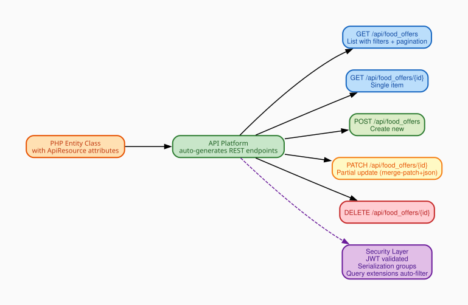

### What API Platform Does

API Platform is a Symfony bundle that **automatically generates REST endpoints** from PHP entity classes. Instead of writing a controller for every endpoint, you annotate the entity and it gets full CRUD immediately.

### Available API Resources

| Resource | Base URL | Who uses it |
|----------|----------|-------------|
| User | `/api/users` | Auth, profile management |
| BusinessPartner | `/api/business_partners` | Business owners + Admin |
| FoodOffer | `/api/food_offers` | Customers (browse) + Business (manage) |
| Order | `/api/orders` | Customers (place) + Business (manage) |
| Address | `/api/addresses` | Customer delivery addresses |
| Image | `/api/images` | Food photos, avatars |
| Review | `/api/reviews` | Customer ratings |
| DeviceToken | `/api/device_tokens` | Push notification registration |
| BusinessBankAccount | `/api/business_bank_accounts` | Business partner bank accounts for payout management |

### Custom Endpoints

| Endpoint | Method | Purpose |
|----------|--------|---------|
| `/api/register` | POST | Create user in Keycloak + MySQL in one step |
| `/api/users/me` | GET | Current user's profile + linked business partner |
| `/api/orders/{id}/status` | PUT | Change order status with transition validation |
| `/api/images/upload` | POST | Upload food offer photo or avatar |
| `/api/favorite_offers/{id}` | POST/DELETE | Save or remove a saved food offer |
| `/api/food_offers/sections` | GET | Home screen initial load — all non-empty categories in one request |
| `/api/food_offers/sections/{category}` | GET | Load the next page of offers for one category row |

### Home Screen Sections API

These two endpoints replace the old pattern of sending one request per category. Instead the home screen loads everything in **one request** and paginates each row independently as the user scrolls.

#### Initial load — `GET /api/food_offers/sections?limit=10`

Returns every category that has at least one active offer. Empty categories are skipped automatically by the backend.

**Example response:**
```json
{
  "sections": [
    {
      "category": "pizza",
      "label": "Pizza",
      "total": 24,
      "limit": 10,
      "hasMore": true,
      "nextPage": 2,
      "items": [ ...10 offer objects... ]
    },
    {
      "category": "bakery",
      "label": "Bakery",
      "total": 5,
      "limit": 10,
      "hasMore": false,
      "nextPage": null,
      "items": [ ...5 offer objects... ]
    }
  ]
}
```

- `total` — live offer count in that category right now
- `limit` — echoed back so the client always uses the same page size for subsequent requests
- `hasMore: false` + `nextPage: null` — row is fully loaded, no pagination needed
- `hasMore: true` + `nextPage: 2` — more items exist; scroll right to fetch them

#### Scroll load-more — `GET /api/food_offers/sections/{category}?page=2&limit=10`

Called when the user scrolls near the right edge of a category row. The `page` and `limit` values come directly from the previous response — the client never calculates them.

**Example:** User scrolls to the end of the Pizza row. The app reads `nextPage=2` and `limit=10` from the stored `FoodSectionModel` and calls `GET /api/food_offers/sections/pizza?page=2&limit=10`. The new items are appended to the existing row without affecting any other category.

**Response:** Same shape as a single section object above (without the `sections` wrapper).

> **Route priority note:** The sections controller is registered with `priority: 10` in Symfony so it takes precedence over API Platform's auto-generated `GET /api/food_offers/{id}` route. Without this, `/api/food_offers/sections` would be matched as an item-GET with `id="sections"` and return 404.

### Breaking Changes — Price Field Names

The price fields on `FoodOffer` were renamed in the backend. The **old** names no longer exist in API responses:

| Old JSON key | New JSON key | Meaning |
|-------------|-------------|---------|
| `originPrice` | `originalPrice` | Full retail price (shown struck-through) |
| `price` | `salePrice` | Discounted sale price the customer pays |

The Flutter `FoodOfferModel.fromJson` reads **both** old and new keys with a fallback (`json['originalPrice'] ?? json['originPrice']`) so that entries cached locally before the migration still parse correctly without clearing user data.

All PATCH and POST request bodies must use the **new names** (`originalPrice`, `salePrice`).

### Payment Method Validation

The `paymentMethod` field on orders is validated server-side. Only two values are accepted:

| Value | Meaning |
|-------|---------|
| `card` | Customer pays by card (default) |
| `cash` | Customer pays cash at pickup |

Any other value defaults to `card` in the Flutter model to prevent invalid data reaching the UI.

### Review Conflict

`POST /api/reviews` returns **HTTP 409 Conflict** if the authenticated user has already submitted a review for the same business partner. The app should catch this response and show a message like "You have already reviewed this business."

### Automatic Query Filtering

These filters run automatically — the client never passes them manually:

| Extension | What it does |
|-----------|-------------|
| CurrentUserExtension | Customers only see their own orders |
| OrderBusinessPartnerExtension | Business staff only see orders from their restaurant |
| OrderExtension | Orders always sorted newest-first |

### Pagination and Total Count

Order list responses include pagination metadata. The Flutter `OrderController` reads the server-reported total and stores it as:

```dart
final totalOrders = 0.obs;   // set from result.totalOrders (hydra:totalItems)
```

This is the **total count across all pages**, not just the current page. It is shown in the My Orders header badge and the Profile stat card. Using the server-reported total means the number is correct even when only the first page of orders has been loaded.

### Serialization Groups — Who Sees What

Each API operation uses a named group to control which fields are included:

```
GET  /api/food_offers     → group: foodOffer:collection:get
GET  /api/food_offers/7   → group: foodOffer:item:get
POST /api/food_offers     → group: foodOffer:item:post
PATCH /api/food_offers/7  → group: foodOffer:item:patch
```

Banking details, password hashes, and internal IDs are excluded from public groups automatically.

> `BusinessBankAccount` uses groups `businessBankAccount:collection:get`, `businessBankAccount:item:get`, and `businessBankAccount:item:post`. The `isDefault` field must be present in the collection group for the default indicator to display correctly after re-login.

---

## 6. Food Offer Lifecycle

### Lifecycle Diagram

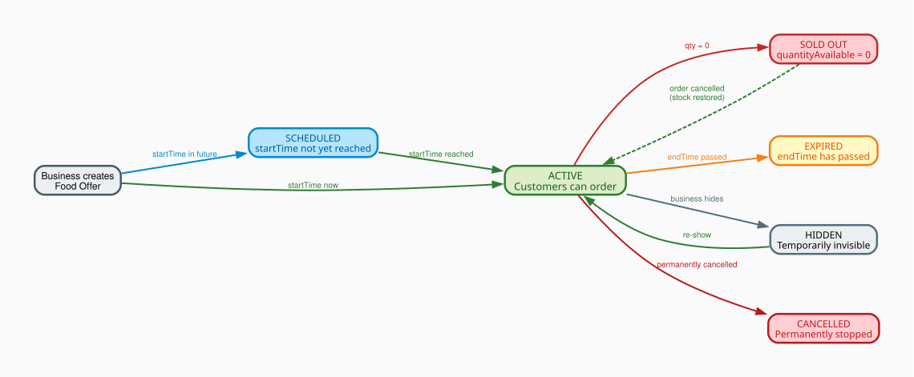

### How to Read the Diagram

Each **box** is a status the food offer can be in. **Arrows** show what event moves the offer between states. Solid arrows are normal transitions; the dashed arrow (Sold Out → Active) is exceptional — only happens when a cancelled order restores stock.

### Color Legend

| Color | Status | Meaning |
|-------|--------|---------|
| Green | ACTIVE | Customers can see and order right now |
| Blue | SCHEDULED | Exists but pickup window hasn't started |
| Red | SOLD OUT / CANCELLED | No more orders — sold out is temporary, cancelled is permanent |
| Yellow | EXPIRED | Pickup window ended |
| Grey | HIDDEN / INACTIVE | Business manually disabled — can re-enable any time |

### Real Example — "Morning Pastry Bag" at a Bakery

Mario creates the offer at **7:00 AM**: `quantityAvailable=5`, `startTime=09:00`, `endTime=10:30`.

| Time | Event | Status |
|------|-------|--------|
| 07:00 | Mario creates the offer | **SCHEDULED** (startTime not yet reached) |
| 09:00 | Clock reaches startTime | **ACTIVE** (computed at runtime — no DB write needed) |
| 09:10 | Maria orders 2 bags | ACTIVE, `quantityAvailable=3` |
| 09:30 | Two more customers order 1 each | ACTIVE, `quantityAvailable=1` |
| 09:45 | Last customer buys the final bag | **SOLD OUT** (`quantityAvailable=0`) |
| 09:50 | Maria cancels her order | **ACTIVE** again (`quantityAvailable=2` restored) |
| 10:30 | endTime passes | **EXPIRED** (no more orders accepted) |

> **How does the status stay correct?** The `status` column stores the raw value ('active'). When any client requests the offer, the server runs a quick check: if `quantityAvailable=0` → return 'sold_out'; if `now > endTime` → return 'expired'; otherwise return what's stored. No background job needed.

### Weight-Based Offers

Not all food is sold in fixed bags. Butchers, fishmongers, and delis sell by weight. For these offers `isWeightBased=true` and the piece-based fields (`salePrice`, `quantityTotal`, `quantityAvailable`) are NULL. Instead:

| Field | Example | Meaning |
|-------|---------|---------|
| `pricePerKg` | `3.50` | Price per kilogram |
| `weightTotalKg` | `5.0` | Total kg available when created |
| `weightAvailableKg` | `4.2` | Remaining kg (decrements per order) |
| `minOrderKg` | `0.5` | Minimum purchase in kg (optional) |

At checkout the customer enters how many kg they want (≥ `minOrderKg`). The server computes `subtotal = requestedKg × pricePerKg`. The "Sold Out" threshold is `weightAvailableKg = 0`.

### Food Offer Categories

The backend uses a 17-value category enum. All category values are snake_case strings:

| API value | Display label |
|-----------|--------------|
| `fast_food` | Fast Food |
| `pizza` | Pizza |
| `bakery` | Bakery |
| `restaurant` | Restaurant |
| `supermarket` | Supermarket |
| `cafe` | Café |
| `meals` | Meals |
| `bread_pastries` | Bread & Pastries |
| `fruits_vegetables` | Fruits & Vegetables |
| `groceries` | Groceries |
| `hot_drinks` | Hot Drinks |
| `cheese_dairy` | Cheese & Dairy |
| `butcher` | Butcher |
| `fish` | Fish |
| `deli_catering` | Deli & Catering |
| `flowers` | Flowers |
| `salads` | Salads |

The Flutter app centralizes label resolution in `FoodCategories.label(String cat)` — all screens call this one method so category display names are consistent and fully translated. Legacy values from an earlier backend (`caffe`, `meal`, `vegetables`, `drinks`, `florist`) are mapped to their modern equivalents inside this method.

### What the Business Can Control Manually

| Action | Result | Reversible? |
|--------|--------|-------------|
| Hide offer | Disappears from customer app immediately | Yes — un-hide any time |
| Set inactive | Same as hidden, signals longer-term pause | Yes |
| Cancel offer | Permanently stopped | **No** — final state |

### Overselling Prevention

Two safety nets:

1. **Application check** — Before saving any order, the server reads `quantityAvailable` and rejects if less than the quantity requested. Example: only 1 bag left, customer orders 3 → "Not enough stock".

2. **Optimistic lock** — Two customers tap "Order" on the last bag at exactly the same millisecond. Both pass the application check simultaneously. But the `version` column means only the first one to write succeeds. The second sees a version mismatch and is rejected automatically.

---

## 7. Order Lifecycle

### Lifecycle Diagram

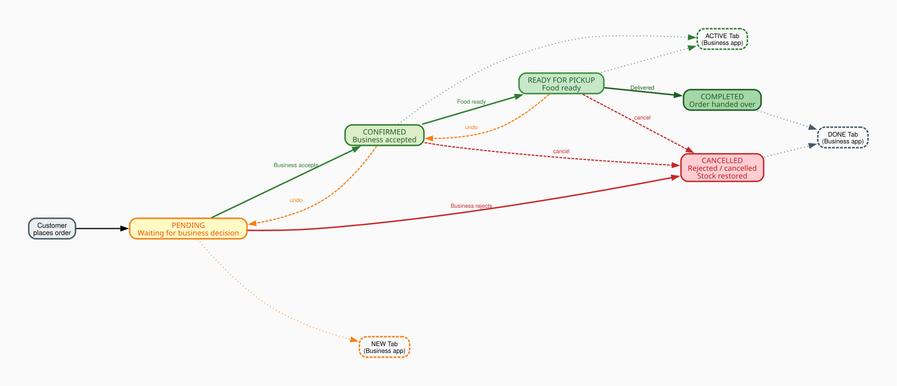

### How to Read the Diagram

Each **box** is a status. **Solid arrows** = normal path forward. **Dashed arrows** = undo or alternative paths. **Dotted lines** connect each status to the tab in the Business app where it appears.

### Color Legend

| Color | Status | Business App Tab |
|-------|--------|-----------------|
| Yellow | PENDING — waiting for business decision | NEW tab |
| Light green | CONFIRMED — business accepted, food being prepared | ACTIVE tab |
| Medium green | READY FOR PICKUP — food is packed | ACTIVE tab |
| Dark green | COMPLETED — order handed over | DONE tab |
| Red | CANCELLED — rejected or cancelled | DONE tab |

### Real Example — Maria Orders, Mario Accepts

1. **Maria places the order** → status = `pending`. Order appears in Mario's **NEW tab**. Mario's phone buzzes: "New order arrived!"
2. **Mario taps Accept** → status = `confirmed`. Card **immediately** moves from NEW to **ACTIVE tab** (optimistic update — no waiting for server response).
3. **Mario finishes packing** → taps "Mark Ready" → status = `ready_for_pickup`. Still in ACTIVE tab.
4. **Order is delivered** → Mario taps "Complete" → status = `completed`. Card moves to **DONE tab**.

### Alternative Path — Mario Rejects

1. Mario taps **Reject** → status = `cancelled`
2. Order moves directly to **DONE tab**
3. Stock restored — `quantityAvailable` goes back up (2 Sushi Bags returned to inventory)
4. Maria sees "Cancelled" in her order history

> **Rules enforced by the server:** You cannot skip steps. Trying to jump from PENDING directly to COMPLETED returns a 422 error. COMPLETED and CANCELLED are final states — they cannot be undone.

### Status Transitions

| Current Status | Allowed Next | Who triggers it |
|---------------|-------------|-----------------|
| pending | confirmed, cancelled | Business partner |
| confirmed | ready_for_pickup, cancelled, pending | Business partner |
| ready_for_pickup | completed, cancelled, confirmed | Business partner |
| completed | — (final) | — |
| cancelled | — (final) | — |

### Payment Status

`paymentStatus` is tracked independently of the delivery lifecycle:

| Value | Meaning | When it appears |
|-------|---------|-----------------|
| `pending` | Payment not yet confirmed | All new orders — shown in blue |
| `paid` | Payment received | After payment is confirmed — shown in green |
| `refunded` | Money returned to customer | After a refund is processed — shown in amber |

Both the customer order detail screen and the business order detail screen show the payment method and payment status in the price summary section.

---

### Order Placement — What the Server Does Behind the Scenes

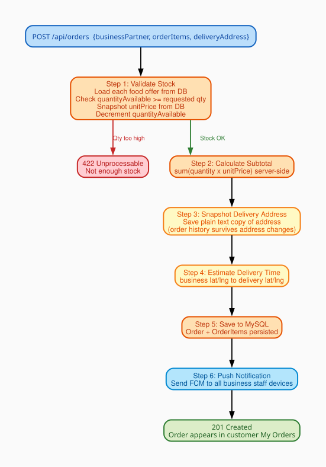

When a customer taps "Confirm Order", the server silently runs 6 steps before responding.

**Example: Maria orders 2 Sushi Bags (€5.99 each) + €2.50 delivery fee**

**Step 1 — Validate Stock**  
Server reads `quantityAvailable=3`. Maria wants 2. OK — stock decremented to `1`. Server reads the price from the database (€5.99) — it never trusts the price the app sent.  
*If stock was 1 and Maria tried to order 2 → "Not enough stock" error, order not created.*

**Step 2 — Calculate Subtotal (server-side)**  
2 × €5.99 = **€11.98**. Calculated on the server — the app cannot send a fake lower amount.

**Step 3 — Snapshot the Delivery Address**  
Saves `"Karl-Marx-Str. 12, 12043 Berlin, Germany"` as plain text on the order. Even if Maria deletes her saved address tomorrow, this order permanently shows the correct delivery location.

**Step 4 — Estimate Delivery Time**  
Uses the business and customer coordinates (latitude/longitude) to calculate an ETA and save it on the order.

**Step 5 — Save Everything to MySQL**  
Order + all OrderItems saved in one transaction. Total = €11.98 + €2.50 = **€14.48**. `titleSnapshot` and `categorySnapshot` are written to each `order_item` row.

**Step 6 — Send Push Notification**  
Looks up all staff device tokens for Mario's Bistro. Sends FCM push to every device: "New order! Maria — 2 × Sushi Bag — €14.48". Mario's phone buzzes in under 2 seconds.

---

## 8. Customer Dashboard

### Customer Journey Diagram

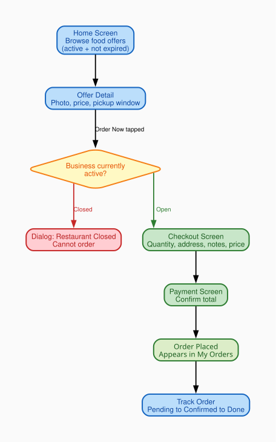

### How to Read the Diagram

Each **box** is a screen. **Arrows** show what action takes you to the next screen. The **red path** shows what happens when a restaurant is closed (dead end — cannot order). The **green path** is the happy path: successful order from browsing to tracking.

### Real Example — Maria Finds and Orders a Sushi Bag

| Step | Screen | What happens |
|------|--------|-------------|
| 1 | Home Screen | Maria sees a list of available offers. Only active offers from open restaurants are shown. Closed restaurant offers are hidden automatically. |
| 2 | Offer Detail | Maria taps "Sushi Bag". Sees photo, original price (€12.00), sale price (€5.99), 3 bags left, pickup 18:00–20:00. |
| 3 | Business Active Check | Maria taps "Order Now". App checks if Mario's Bistro is open. **Open** → proceeds to Checkout. **Closed** → dialog: "Mario's Bistro is temporarily closed." Cannot continue. |
| 4 | Checkout Screen | Maria selects 2 bags, chooses delivery address "Karl-Marx-Str. 12", types "no wasabi please". Price: subtotal €11.98 + delivery €2.50 = **€14.48**. |
| 5 | Payment Screen | Maria confirms payment and taps "Place Order". |
| 6 | Order Placed | Screen shows "Waiting for confirmation." Order appears in My Orders as Pending. |
| 7 | Track Order | Maria watches status update: Pending → Confirmed → Ready → Done. |

### Home Screen — How Data Loads

The home screen uses the **sections API** (see Section 5). One request returns all non-empty categories at once.

**Before (old approach):** 17 parallel requests fired at startup — one per category. Every category always fetched, even empty ones.

**Now:** Single `GET /api/food_offers/sections?limit=10`. Only categories with active offers are returned. The network cost at startup is one round-trip regardless of how many categories exist.

**Per-row load-more:** Each horizontal category row manages its own pagination cursor independently. Scrolling the Pizza row never affects the Bakery row.

```
App opens
  ↓
GET /api/food_offers/sections?limit=10
  → sections: [ pizza(10), bakery(5), cafe(10), ... ]
  → UI renders each row immediately

User scrolls Pizza row to the right edge
  ↓
GET /api/food_offers/sections/pizza?page=2&limit=10
  → 10 more pizza items appended to the Pizza row
  → Bakery, Cafe rows unchanged
```

**Category pill tap:** When the user taps "Pizza" in the pill row, the app calls `GET /api/food_offers/sections/pizza?page=1&limit=10` and shows only that one row. Tapping "All" returns to the full multi-row view.

**Filters applied by the backend on every sections request:**

| Filter | What it does | Example |
|--------|-------------|---------|
| `status=active` | Only active offers | Hides sold-out, expired, hidden offers |
| `endTime after now` | Pickup window still open | Hides bags whose window closed at 18:00 if it's now 18:30 |
| `businessPartner.isActive=true` | Only open restaurants | Hides all Mario's Bistro offers if he toggled "Closed" |

### My Orders Screen

The My Orders screen shows the customer's full order history with live status updates.

**Total order count:** The green header badge shows the **server-reported total** (`OrderController.totalOrders`, sourced from `hydra:totalItems` in the API response). This is the count across all pages — accurate even when pagination means only the first 20 orders have been loaded into memory.

The same total is shown on the Profile tab's Orders stat card. Both update reactively via `Obx` whenever the controller refreshes.

**Per-order display:** Each order card shows order ID, business name, category badge (using `titleSnapshot`/`categorySnapshot`), delivery address, date, and total price.

### Customer Navigation (Bottom Bar)

| Tab | Content | Example use |
|-----|---------|-------------|
| Home | All available food offers | Maria browses for tonight's dinner deal |
| My Orders | All orders with live status + total count badge | Maria checks if Mario accepted yet |
| Favorites | Saved offers | Maria's favourite bakery bag — one tap to re-order |
| Profile | Order count stat, addresses, settings, logout | Maria checks her total order history count |

### Multi-Language Support

The app fully supports English and Persian (Farsi). Language preference is stored in Hive (`AppStorage`) under the key `locale_lang` and persists across app restarts. All user-visible strings go through GetX's `.tr` system — no hardcoded text in UI widgets.

Persian uses the **Vazirmatn** font (via `google_fonts`) which correctly renders RTL text. Filter chip rows that must stay left-to-right (e.g. sort chips, category pills) are wrapped in `Directionality(textDirection: TextDirection.ltr)` to avoid layout mirroring.

---

## 9. Business Partner Dashboard

### Dashboard Diagram

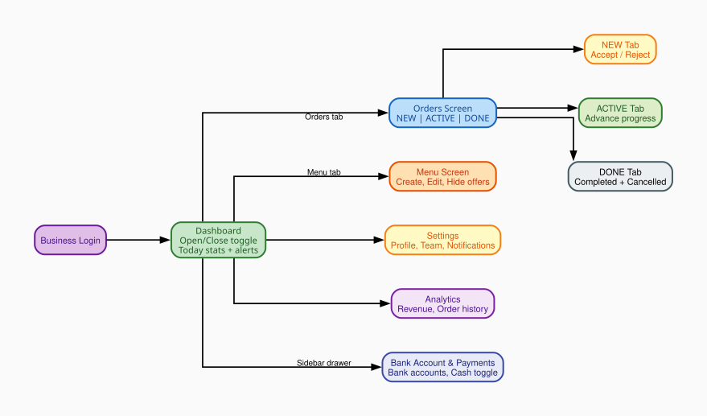

### How to Read the Diagram

Login leads to the main **Dashboard**. From there, areas branch off. The **Orders** branch is the most important for daily operation — it splits into three tabs that directly map to the order lifecycle. The **Sidebar drawer** gives access to the Bank Account & Payments screen.

### Real Example — Mario's Tuesday Morning

#### Step 1 — Open the Restaurant (Dashboard)

Mario logs in and taps the **Open/Closed toggle** → restaurant becomes Open (`isActive=true`). The app updates instantly. Behind the scenes the server saves the change. Mario's food offers now appear on every customer's Home screen.

If the toggle were "Closed", every customer tapping "Order Now" would see: "Mario's Bistro is temporarily closed" — no order possible.

#### Step 2 — Publish a Food Offer (Menu Screen)

Mario goes to **Menu** and taps "Add New Offer":

| Field | Mario types | What it controls |
|-------|-------------|-----------------|
| Title | Sushi Bag | What customers see on the card |
| Category | Restaurant | Customer filter on Home screen (one of 17 backend values) |
| Original price | €12.00 | Shown struck-through (discount indicator) — sent as `originalPrice` |
| Sale price | €5.99 | What customer pays — sent as `salePrice`; locked into order_item at order time |
| Quantity | 5 | Sets `quantityAvailable=5`; decrements per order (piece-based mode) |
| Sell by weight | (toggle) | Switches to weight mode: pricePerKg + weightAvailableKg + optional minOrderKg |
| Pickup window | 18:00 – 20:00 | `startTime`/`endTime`; offer expires after 20:00 |
| Photo | (uploads image) | Stored in `image` table; shown on offer card |

Mario taps "Publish" → offer is **ACTIVE** on customer Home screen immediately.

> **KYC gate:** If Mario's account is `kycStatus=pending`, the Publish button is disabled. He can save drafts but they won't show to customers until an Admin approves his account.

#### Step 3 — Receiving a New Order (Orders Screen — NEW tab)

Mario's phone buzzes: "New order! Maria — 2 × Sushi Bag — €14.48". He opens the **NEW tab**:

| Action | What happens | Where the order goes |
|--------|-------------|---------------------|
| Tap Accept | Status → `confirmed`. Card moves instantly (optimistic update). | NEW → **ACTIVE tab** |
| Tap Reject | Status → `cancelled`. Stock restored (+2 bags). Card moves instantly. | NEW → **DONE tab** |

> **Optimistic update:** When Mario taps Accept, the card moves immediately — no spinner. If the server call fails (e.g. no internet), the card snaps back and Mario sees an error.

#### Step 4 — Advancing the Order (ACTIVE tab)

1. Food packed → "Mark Ready" → status = `ready_for_pickup` (stays in ACTIVE)
2. Order delivered → "Complete" → status = `completed` → moves to **DONE tab**

If Mario made a mistake, he can tap "Move Back" to undo one step, or "Cancel" to cancel entirely. When cancelling, Mario can optionally enter a `cancellationReason` which is stored on the order for customer-facing display.

#### Step 5 — End of Day (DONE tab)

View-only. Shows all completed and cancelled orders — customer name, total, completion time. Useful for daily revenue reconciliation.

**Limit filter:** At the top of the DONE tab, Mario can choose how many recent orders to display: **Last 5 / Last 10 / Last 20 / Last 50 / All**. This is a client-side filter on the already-loaded list, not a new API call. The chip row scrolls horizontally so it never overflows regardless of language or screen width.

### Menu Management

| Action | When to use | Effect on customers |
|--------|------------|---------------------|
| Publish new offer | New bag available today | Appears on Home screen immediately |
| Edit offer | Fix typo or change quantity | Customers see updated info |
| Hide offer | "Not ready yet, 30 min" | Disappears from Home — can un-hide any time |
| Set inactive | Done for today | Same as hidden, signals longer pause |
| Delete offer | Permanent removal | Gone forever; linked images also deleted |

### Team Members

Mario invites his colleague Luigi by email. Luigi gets `ROLE_MEMBER`, his account links to Mario's Bistro. Luigi sees the same Business Dashboard. When a new order arrives, **both** Mario's and Luigi's phones receive the push notification.

#### Bank Account & Payments

Mario navigates to the **Bank Account & Payments** screen from the sidebar drawer.

| Feature | What it does |
|---------|-------------|
| Multiple bank accounts | Mario can add several bank accounts (IBAN, SWIFT/BIC, holder name, account number) |
| Default account | Tapping a card sets it as the default — the radio indicator animates smoothly. Only one account can be default at a time. |
| Edit / Delete | Each card has an Edit button (opens a bottom sheet) and a Delete button with a confirmation dialog. |
| Cash at Pickup toggle | Mario enables "Accept Cash at Pickup" — customers then see a "Pay at Pickup (Cash)" option at checkout. |
| Payment badge on orders | Order cards show a "Cash" or "Card" badge based on how the customer paid. |

---

## 10. Admin Dashboard

### What the Admin Sees

The Admin bypasses all automatic query filters. Where a customer sees only their own orders, the Admin sees every order on the platform.

| Tab | Content | Key Actions |
|-----|---------|-------------|
| Overview | Total users, orders today, revenue, live count | Platform health |
| Partners | All business partners | Approve / reject KYC, view their offers and orders |
| Customers | All customer accounts | View order history, contact info |
| Orders | All orders platform-wide | Filter by status, date, business |
| Offers | All food offers | See active, expired, sold-out across all businesses |

`AdminController` shows a `StaleBanner` above all four tabs (added 2026-07-19) whenever `isFromCache` is true — one flag covers all five underlying fetches (stats, partners, customers, offers, orders), so a single banner is enough instead of one per tab. See [[project_hive_cache_migration]] / DOCUMENTATION.md §11 for the caching details.

### KYC Approval Workflow

1. Business registers → `kycStatus = 'pending'`
2. Admin sees the business in Partners tab with a "Pending" badge
3. Admin reviews registration details (business name, registration number, tax info)
4. Admin taps Approve → `PATCH /api/business_partners/{id}` sets `kycStatus = 'approved'`
5. Business can now create and publish food offers

---

## 11. Caching Architecture

The app uses two independent caching layers with different purposes. As of 2026-07-19, the key-value layer runs on **Hive (`hive_ce`)** instead of GetStorage — see [[project_hive_cache_migration]] for why and what changed.

### Layer 1 — API Data Cache (AppStorage/Hive + DataCacheService)

**Library:** `hive_ce` / `hive_ce_flutter`, wrapped by `lib/services/app_storage.dart` (`AppStorage`) — a single Hive box exposing a GetStorage-like `read<T>()`/`write()` API so every call site changed only its constructor, not its call shape.  
**Purpose:** Show data immediately on app launch before the network request completes. Users see content within milliseconds instead of waiting for a round-trip to the server.

**How it works:**

```
App launches
  ↓
DataCacheService.load('offers_home') → cache younger than 5 min? → returns JSON instantly → UI renders
                                       → cache older than 5 min?   → returns null → UI shows its normal loading spinner
  ↓  (in parallel)
API call fires → response arrives → controller updates .obs state → UI re-renders with fresh data → new cache entry saved
```

**Storage format:** Each entry is stored under a namespaced key (`data_cache__<name>`) as:
```json
{ "ts": 1751234567890, "data": { ...raw API JSON... } }
```

The `ts` field is the Unix timestamp (ms) of when the data was saved.

**TTL (expiry):** `DataCacheService.load()` now checks `ts` against a max age — **5 minutes by default** — before returning anything. An entry older than that is treated exactly like no cache at all: `load()` returns `null` and the caller falls through to its normal fetch-and-spinner path instead of showing outdated data. Previously the `ts` field was recorded but nothing read it back, so a cache from days ago could still flash on screen for a moment.

**Stale banner:** When the UI is showing cached data that's still within its TTL (not live), a yellow `StaleBanner` (`lib/widgets/common/stale_banner.dart`) appears with a "Refresh" button, so it's visible to the user that they may be seeing a few-minutes-old snapshot. As of 2026-07-19 it's wired on every screen that tracks `isFromCache` — one shared widget, no per-screen copy:

| Portal | Screen | Sits above |
|---|---|---|
| Customer | Home (`FoodOfferController`) | The offer list |
| Customer | Orders (`OrderController`) | The order list |
| Customer | Favorites (`FavoritesOfferController`) | The favorites list |
| Business | Menu (`BusinessOfferController`) | The offer list |
| Business | Orders (`BusinessOrderController`) | The tab bar view |
| Business | Dashboard Overview (`BusinessPartnerController`) | The scrollable overview content — placed *outside* the tab's own padding so the banner's built-in inset doesn't stack with it |
| Admin | All four tabs (`AdminController`) | The `IndexedStack` — one banner covers all five underlying fetches (stats/partners/customers/offers/orders) since they share one `isFromCache` flag |

**Home screen cache:** The sections response is cached under the key `food_sections_v1` as a `List<FoodSectionModel>`. Each section includes all the items loaded so far plus `hasMore`, `nextPage`, and `limit`. On next launch the cached sections are shown instantly (if still fresh) while the real `GET /api/food_offers/sections` call is in flight.

> The cache key includes a version suffix (`_v1`) so that if the response shape changes in the future, old incompatible cache entries are simply ignored rather than causing parse errors.

**Cache invalidation:** Calling `DataCacheService.remove(key)` deletes one entry. `DataCacheService.clearAll()` deletes all `data_cache__*` entries (called from Settings → Clear Cache).

**What is cached today**, all following the same cache-first-then-refresh pattern with the same `load()`/`save()` pair:

| Portal | Controller | Cache key |
|---|---|---|
| Customer | `FoodOfferController` (home/sections) | `food_sections_v1` |
| Customer | `OrderController` (order list) | `customer_orders` |
| Customer | `FavoritesOfferController` | `customer_favorites` |
| Business | `BusinessPartnerController` (own profile) | `business_partner` |
| Business | `BusinessOfferController` (menu/my offers) | `business_offers_<partnerId>` |
| Business | `BusinessOrderController` (order queue) | `business_orders` |
| Admin | `AdminController` (stats, partners, customers, offers, orders) | `admin_stats`, `admin_partners`, `admin_customers`, `admin_offers`, `admin_orders` — each fetched and cached independently so one slow endpoint doesn't block the others |

Not cached, deliberately: `BusinessOrderHistoryController` (its cache key would need to encode the current date-range + status filters, adding complexity for a screen that's rarely opened cold) and `BusinessAnalyticsController` / `BusinessEarningsController` (still mock data, no real API call yet to cache).

**Backward-compatible reads after API field rename:**  
When the backend renamed `originPrice` → `originalPrice` and `price` → `salePrice`, existing cache entries still had the old keys. Rather than invalidating all cached data (losing every user's locally stored offers on first launch), `FoodOfferModel.fromJson` uses a dual-key fallback:

```dart
originalPrice: (json['originalPrice'] ?? json['originPrice'])?.toString(),
price:         (json['salePrice']      ?? json['price']     )?.toString(),
```

Old cached entries parse correctly with the old keys. New API responses parse correctly with the new keys. No user data is lost.

### Layer 2 — Image Pixel Cache (flutter_cache_manager / CachedNetworkImage)

**Library:** `cached_network_image` + `flutter_cache_manager`  
**Purpose:** Avoid re-downloading food offer photos and avatars on every screen visit. Images are saved to the device's disk cache by `flutter_cache_manager` and displayed instantly on subsequent loads.

**How it works:** `CachedNetworkImage` shows a placeholder while the image downloads on first load, then stores the decoded pixels on disk. On subsequent visits the image appears immediately from disk — no network request.

### Layer 3 — Avatar URL Cache (AppStorage/Hive)

**Purpose:** Store the resolved CDN URL for user and business avatars so they don't have to be re-fetched from the profile API on every app open.  
**Keys:** Prefixed with `avatar_url__` in the same Hive box as everything else in `AppStorage`.

### Cache Clear (Settings Screen)

The `CacheService.confirmAndClear()` method shows a confirmation dialog and then clears **all three layers** in sequence:

1. Remove all `avatar_url__*` keys from AppStorage/Hive
2. Call `DataCacheService.clearAll()` — removes all `data_cache__*` keys
3. Call `DefaultCacheManager().emptyCache()` — deletes all cached image files from disk

**What is NOT cleared:**
- `locale_lang` — language preference is preserved
- Auth tokens — stored in `flutter_secure_storage` (iOS Keychain / Android Keystore), completely separate from Hive and never touched by cache clearing

---

## 12. Tech Stack Reference

| Layer | Technology | Why chosen |
|-------|------------|------------|
| Mobile UI | Flutter (Dart) | Single codebase for iOS + Android; fast native UI |
| State Management | GetX | Reactive state + routing + dependency injection in one package |
| HTTP Client | Dio | Interceptors for automatic token injection and refresh |
| Secure Storage | FlutterSecureStorage | iOS Keychain / Android Keystore — tokens stored encrypted |
| API Data Cache | Hive (`hive_ce`) | Fast key-value store for raw JSON blobs; survives app restarts; TTL-checked (5 min) on read; cleared from Settings |
| Image Cache | flutter_cache_manager | Disk-based image cache; used by CachedNetworkImage; cleared from Settings |
| Multi-language | GetX Translations | `.tr` on any string key; FA/EN string files; RTL support via Directionality wrapper |
| Auth Server | Keycloak | Open-source, self-hosted; manages passwords, JWT signing, roles |
| API Framework | Symfony + API Platform | Auto-generates REST endpoints; built-in filters, pagination, serialization groups |
| ORM | Doctrine | Maps PHP classes to MySQL; handles migrations, transactions, optimistic locks |
| Database | MySQL | Relational structure; strong ACID guarantees for orders and stock |
| Infrastructure | Docker | Keycloak and MySQL isolated in containers |
| Push Notifications | Firebase FCM | Cross-platform iOS + Android push delivery |

### Flutter App Architecture (GetX Pattern)

```
Screen (View)         — displays UI only, zero business logic
      │ reads .obs reactive values
      ▼
Controller            — holds state (.obs) + calls services
      │ calls
      ▼
Service               — makes HTTP calls with Dio, parses JSON
      │ returns
      ▼
Model (fromJson)      — plain Dart data class, no UI, no network
```

When a controller updates an `.obs` value, every `Obx()` widget that reads it rebuilds automatically. No `setState()` needed.

### Full API Request Lifecycle

```
1.  User taps button in the UI
2.  Screen calls a method on the Controller
3.  Controller calls a Service method
4.  Service calls Dio to make an HTTP request
5.  AuthInterceptor runs:
       a. Reads stored access token
       b. If expired: calls Keycloak with refresh_token for a new token
       c. Attaches "Authorization: Bearer <token>" to the request
6.  HTTP request leaves the phone
7.  Symfony receives the request
8.  Keycloak JWT Guard validates the token signature + expiry
9.  KeycloakUserProvider looks up the User in MySQL by email
10. Doctrine query extensions add automatic WHERE clauses
    (e.g. "AND order.user_id = :current_user_id")
11. API Platform serializes the result using the active group
    (only allowed fields included)
12. JSON response returns to Dio
13. Service parses JSON into a Model via fromJson()
14. Controller updates .obs reactive state
    (e.g. totalOrders.value = result.totalOrders from hydra:totalItems)
15. DataCacheService.save() writes the raw JSON + timestamp to Hive (AppStorage)
16. Obx() widgets rebuild automatically
17. User sees the updated UI
```
